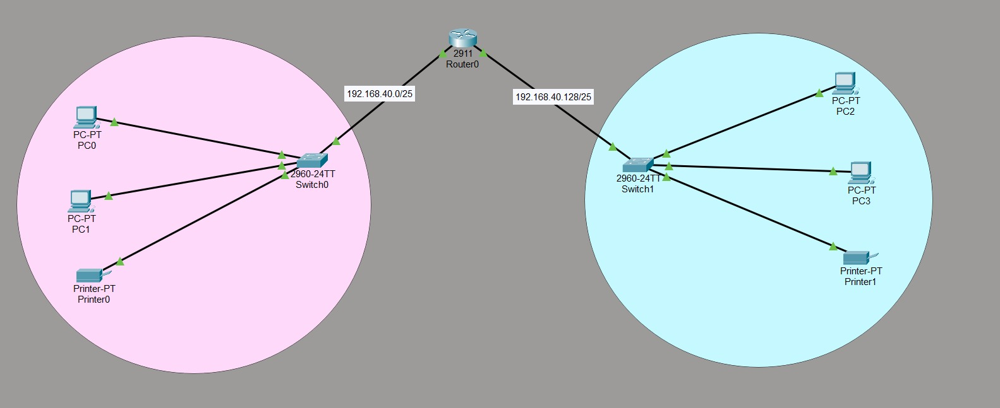
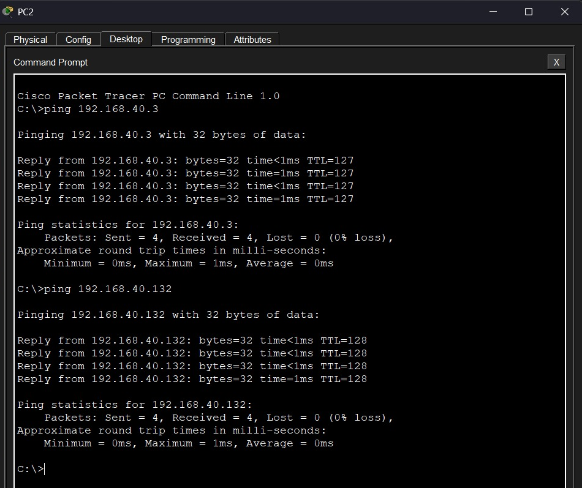

# Simple Networking Project — Accounts & Delivery Network

A basic departmental network designed and simulated using **Cisco Packet Tracer**. This project connects the Accounts and Delivery departments through a router and two switches, with each department assigned its own IP subnet.

## Objective

Build a network that allows devices in the Accounts and Delivery departments to communicate using the given network address `192.168.40.0`.

This project focuses on basic network design, IPv4 subnetting, IP configuration, and connectivity testing.

## Tools Used

* Cisco Packet Tracer
* IPv4 subnetting
* Router and switch configuration
* Static IP addressing
* ICMP / Ping

## Network Topology

The network contains:

* **1 Cisco 2911 router**
* **2 Cisco 2960-24TT switches**
* **4 PCs** — 2 in each department
* **2 printers** — 1 in each department

The router connects the two departmental networks and acts as the default gateway for each subnet.



## IP Addressing

The given network `192.168.40.0/24` was divided into two `/25` subnets.

### Accounts Department

**Network:** `192.168.40.0/25`

| Device                       | IP Address     | Subnet Mask       | Default Gateway |
| ---------------------------- | -------------- | ----------------- | --------------- |
| Router0 — Accounts Interface | `192.168.40.1` | `255.255.255.128` | —               |
| PC0                          | `192.168.40.2` | `255.255.255.128` | `192.168.40.1`  |
| PC1                          | `192.168.40.3` | `255.255.255.128` | `192.168.40.1`  |
| Printer0                     | `192.168.40.4` | `255.255.255.128` | `192.168.40.1`  |

### Delivery Department

**Network:** `192.168.40.128/25`

| Device                       | IP Address       | Subnet Mask       | Default Gateway  |
| ---------------------------- | ---------------- | ----------------- | ---------------- |
| Router0 — Delivery Interface | `192.168.40.129` | `255.255.255.128` | —                |
| PC2                          | `192.168.40.130` | `255.255.255.128` | `192.168.40.129` |
| PC3                          | `192.168.40.131` | `255.255.255.128` | `192.168.40.129` |
| Printer1                     | `192.168.40.132` | `255.255.255.128` | `192.168.40.129` |

## Subnetting

The original `/24` network was divided into two equal `/25` subnets by borrowing **1 bit** from the host portion.

### Calculation

```text
2ⁿ = Number of subnets
2¹ = 2 subnets
```

**Subnet mask:** `255.255.255.128` (`/25`)

| Subnet   | Network Address     | Usable Host Range                 | Broadcast Address |
| -------- | ------------------- | --------------------------------- | ----------------- |
| Accounts | `192.168.40.0/25`   | `192.168.40.1 – 192.168.40.126`   | `192.168.40.127`  |
| Delivery | `192.168.40.128/25` | `192.168.40.129 – 192.168.40.254` | `192.168.40.255`  |

Detailed subnetting calculations are included in `subnetting-calculations-192.168.40.0.pdf`.

## Connectivity Test

Connectivity was tested using the `ping` command from the PCs.

Example tests:

* PC2 → `192.168.40.3` — Accounts department
* PC2 → `192.168.40.132` — Delivery department printer

The tests returned successful replies with **0% packet loss**, confirming connectivity between the devices.



## Project Files

| File                                       | Description                    |
| ------------------------------------------ | ------------------------------ |
| `accounts-delivery-network.pkt`            | Cisco Packet Tracer simulation |
| `network-topology.jpeg`                    | Network topology screenshot    |
| `connectivity-test.png`                    | Successful ping results        |
| `subnetting-calculations-192.168.40.0.pdf` | Subnetting calculations        |

## What I Practiced

* Dividing a `/24` network into two `/25` subnets
* Identifying network, host, and broadcast addresses
* Assigning IP addresses to router interfaces and end devices
* Configuring default gateways
* Understanding communication between different subnets
* Testing connectivity using ICMP ping
* Documenting a network simulation

## Status

**Completed**
