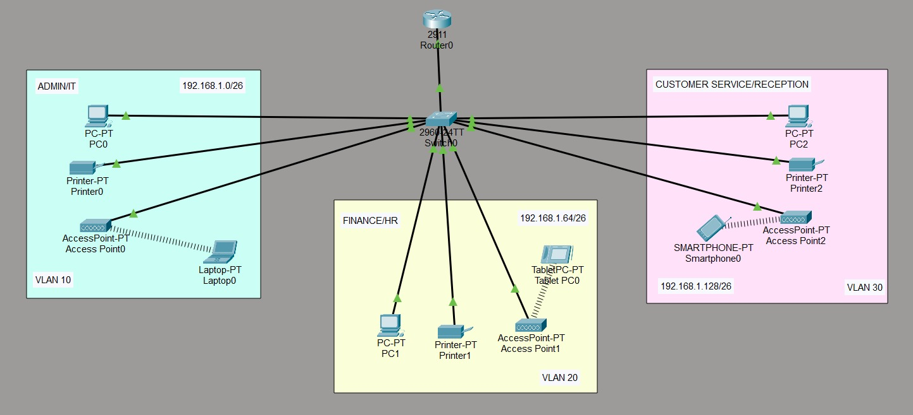

# Small Business VLAN Network

A small business network designed and configured in Cisco Packet Tracer using VLANs, inter-VLAN routing, DHCP, and wireless access points.

## Project Overview

This project is based on a branch office network for XYZ Company. The branch has three departments that need to operate on separate VLANs while still being able to communicate with each other.

The network was built using one Cisco router and one Cisco switch, with wired and wireless devices connected across the departments.

## Network Topology



### Devices Used

* Cisco 2911 Router
* Cisco 2960-24TT Switch
* 3 Access Points
* PCs and printers
* Laptop
* Tablet
* Smartphone

## VLAN & IP Addressing

The base network used for this project is `192.168.1.0/24`.

| Department                   | VLAN | Network          | Gateway       |
| ---------------------------- | ---- | ---------------- | ------------- |
| Admin / IT                   | 10   | 192.168.1.0/26   | 192.168.1.1   |
| Finance / HR                 | 20   | 192.168.1.64/26  | 192.168.1.65  |
| Customer Service / Reception | 30   | 192.168.1.128/26 | 192.168.1.129 |

**Subnet Mask:** `255.255.255.192`

## What I Configured

* Created VLANs for the three departments.
* Assigned switch ports to the appropriate VLANs.
* Configured trunking between the switch and router.
* Configured router subinterfaces for inter-VLAN routing.
* Set up DHCP for automatic IPv4 address assignment.
* Connected access points for wireless users.
* Tested connectivity between devices in different VLANs.

## Commands Used for Verification

```bash
show vlan brief
show interfaces trunk
show ip interface brief
show ip route
show ip dhcp binding
```

## What I Learned

* How VLANs separate departments within the same physical network.
* How Router-on-a-Stick allows communication between VLANs.
* How DHCP automatically assigns IP addresses to devices.
* How subnetting can be used to organize a small business network.
* How wired and wireless devices can be connected to departmental networks.

## Tools

* Cisco Packet Tracer

## Project Files

* `small-business-vlan-network.pkt` — Packet Tracer topology
* `topology.png` — Network diagram

## Author

**Gulpchronics**
