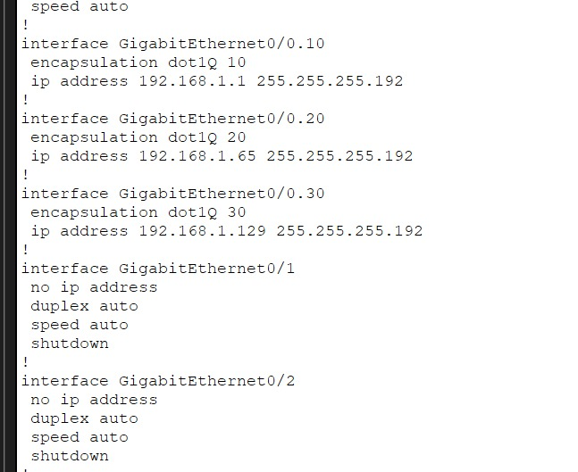
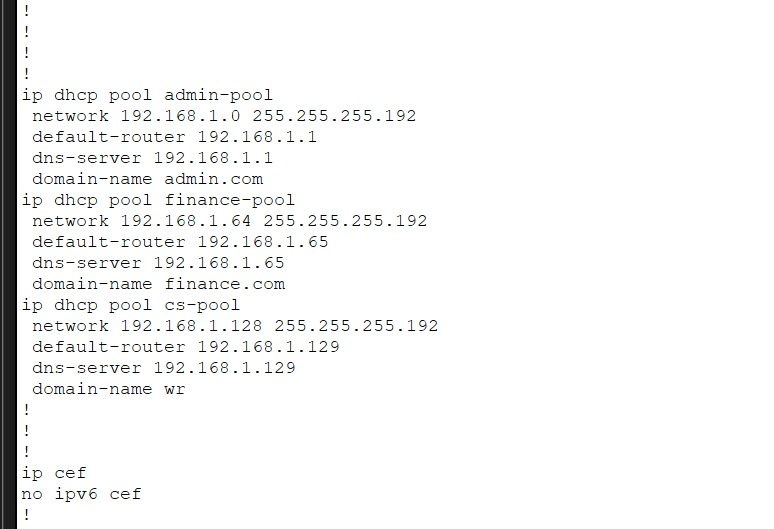
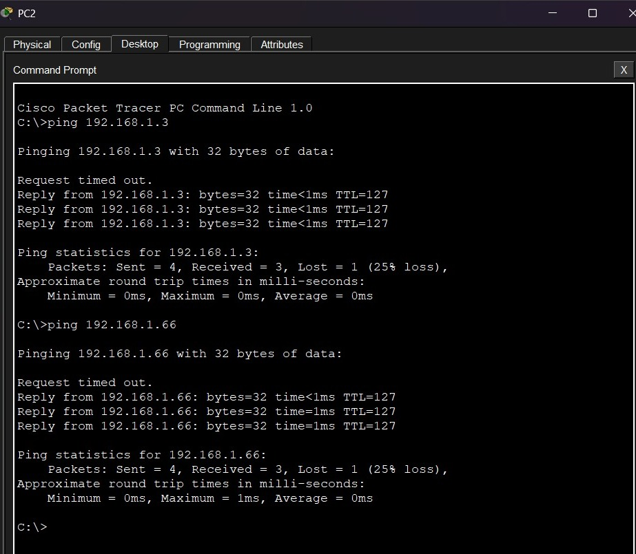

# Small Business VLAN Network

A Cisco Packet Tracer project based on a branch office network design assignment for XYZ Company.

## Project Scenario

XYZ Company is planning to open a branch near Bonalbo, Eastern Australia. The branch needs its own network, separate from the headquarters network, with connectivity for three departments:

* Admin / IT
* Finance / HR
* Customer Service / Reception

The requirements were to use one Cisco router and one Cisco switch, place each department in a separate VLAN, provide wireless connectivity, assign IPv4 addresses automatically using DHCP, and allow devices from all departments to communicate.

I designed and configured the network in Cisco Packet Tracer to meet these requirements.

## Network Topology


### Devices Used

| Device                 | Quantity |
| ---------------------- | -------: |
| Cisco 2911 Router      |        1 |
| Cisco 2960-24TT Switch |        1 |
| Access Points          |        3 |
| PCs                    |        3 |
| Printers               |        3 |
| Laptop                 |        1 |
| Tablet                 |        1 |
| Smartphone             |        1 |

## VLAN & IP Addressing

The base network provided in the assignment was `192.168.1.0/24`. I divided it into /26 subnets for the three departments.

| Department                   | VLAN | Network Address  | Default Gateway |
| ---------------------------- | ---: | ---------------- | --------------- |
| Admin / IT                   |   10 | 192.168.1.0/26   | 192.168.1.1     |
| Finance / HR                 |   20 | 192.168.1.64/26  | 192.168.1.65    |
| Customer Service / Reception |   30 | 192.168.1.128/26 | 192.168.1.129   |

**Subnet Mask:** `255.255.255.192`

| VLAN    | Usable Host Range             | Broadcast Address |
| ------- | ----------------------------- | ----------------- |
| VLAN 10 | 192.168.1.1 – 192.168.1.62    | 192.168.1.63      |
| VLAN 20 | 192.168.1.65 – 192.168.1.126  | 192.168.1.127     |
| VLAN 30 | 192.168.1.129 – 192.168.1.190 | 192.168.1.191     |

The remaining subnet, `192.168.1.192/26`, is available for future expansion.

## Network Configuration

### VLANs

Three VLANs were created on the switch to separate the departments:

* **VLAN 10:** Admin / IT
* **VLAN 20:** Finance / HR
* **VLAN 30:** Customer Service / Reception

Switch ports connected to departmental devices were assigned to their respective VLANs.

### Inter-VLAN Routing

Router-on-a-Stick was used to allow communication between the three VLANs. The switch-router link carries the VLAN traffic using trunking, and router subinterfaces act as the default gateways.

| Subinterface | VLAN | IP Address    |
| ------------ | ---: | ------------- |
| G0/0.10      |   10 | 192.168.1.1   |
| G0/0.20      |   20 | 192.168.1.65  |
| G0/0.30      |   30 | 192.168.1.129 |



### DHCP

DHCP pools were configured on the router so that devices in each department could obtain their IPv4 configuration automatically.



### Wireless Connectivity

Each department has an access point connected to the network. Wireless devices such as the laptop, tablet, and smartphone can connect through the access points.

## Verification & Testing

I used Cisco IOS commands and ping tests to check the configuration and connectivity.

### Commands Used

```bash
show vlan brief
show interfaces trunk
show ip interface brief
show ip route
show ip dhcp binding
```

### Connectivity Test

A ping test was performed between devices in different subnets to check inter-VLAN communication.



## What I Practiced

* Subnetting a /24 network into smaller subnets
* Creating and assigning VLANs
* Configuring trunking
* Configuring Router-on-a-Stick
* Setting up DHCP pools
* Connecting wired and wireless devices
* Testing connectivity between different VLANs

## Project Files

* `small-business-vlan-network.pkt` — Packet Tracer project
* `images/topology.png` — Network topology
* `images/router-subinterfaces.png` — Router subinterface configuration
* `images/dhcp-configuration.png` — DHCP configuration
* `images/connectivity-test.png` — Connectivity test

## Tool

**Cisco Packet Tracer**

## Author

**Gulpchronics**
