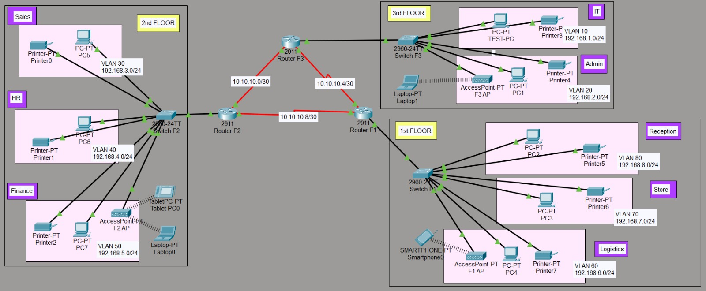
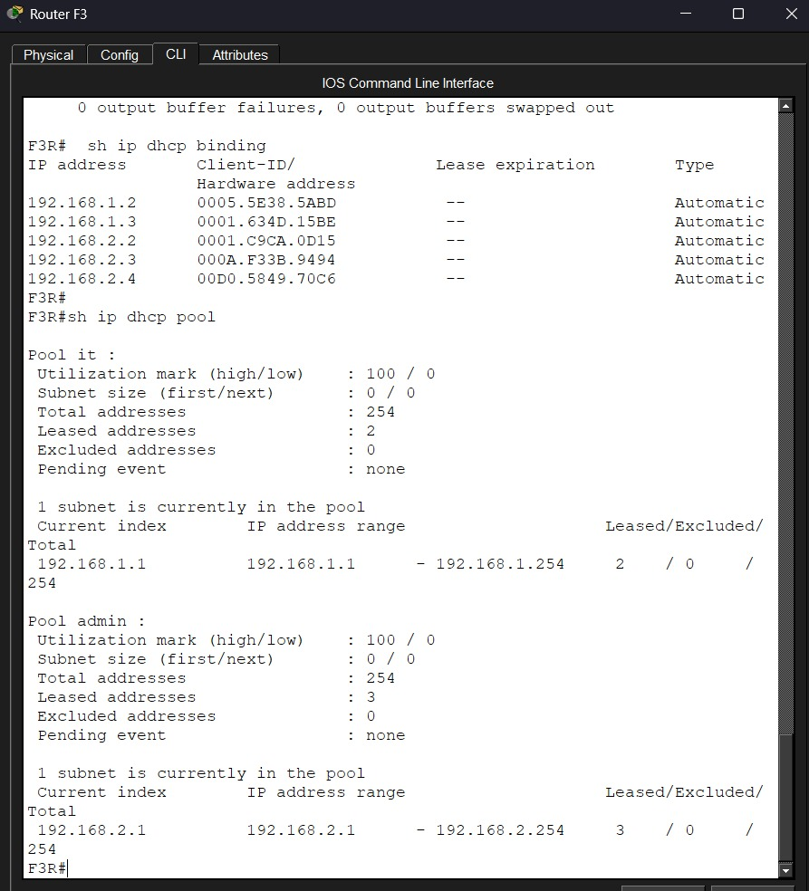
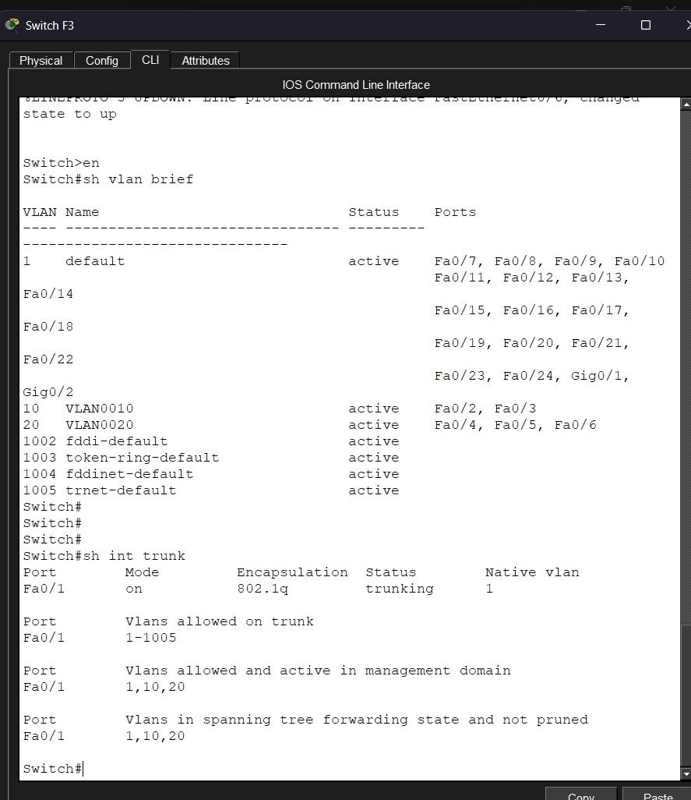
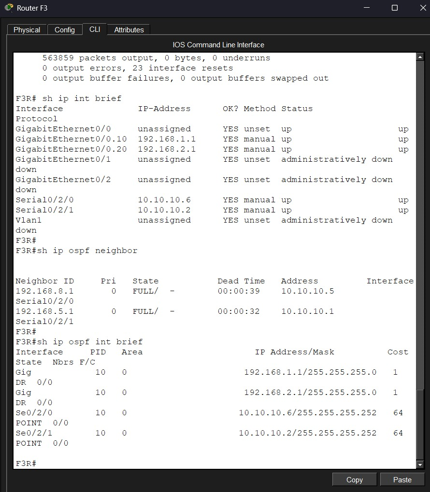
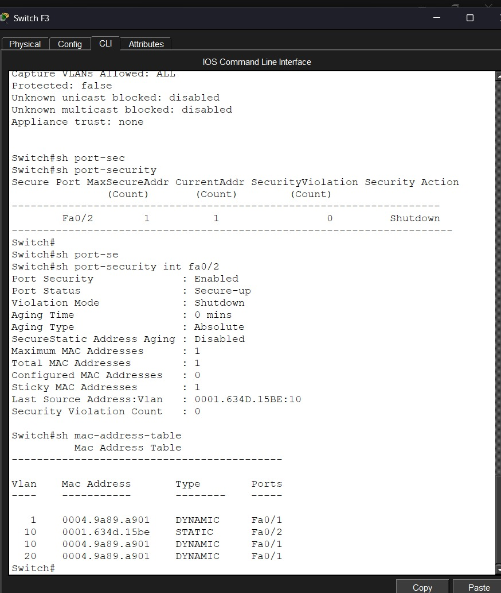
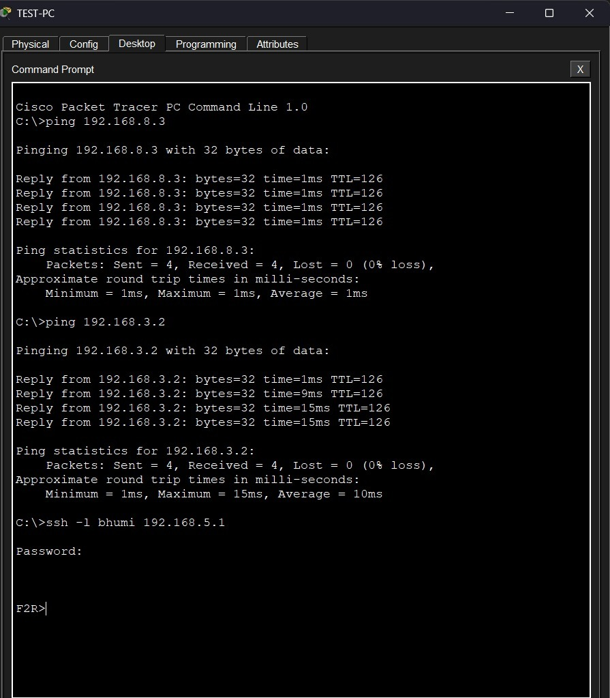

# VIC Modern Hotel Network

A multi-floor hotel network designed and configured in Cisco Packet Tracer as part of my networking practice projects.

The network is based on a hotel with three floors and different departments on each floor. The main focus of this project was to practice VLANs, inter-VLAN communication, routing, DHCP, OSPF, SSH, and switch port security in one network.

## Network Overview

The hotel is divided into three floors:

* **1st Floor:** Reception, Store, and Logistics
* **2nd Floor:** Finance, HR, and Sales
* **3rd Floor:** IT and Admin

Each floor has its own router and switch. The routers are connected using serial DCE cables, and OSPF is used to exchange routes between them.

The network also includes wireless access points, laptops, phones, printers, and a Test-PC for SSH testing.

## Topology



## VLAN and IP Addressing

Each department is assigned a separate VLAN and /24 network.

| Floor | Department | VLAN | Network        |
| ----- | ---------- | ---- | -------------- |
| 1st   | Reception  | 80   | 192.168.8.0/24 |
| 1st   | Store      | 70   | 192.168.7.0/24 |
| 1st   | Logistics  | 60   | 192.168.6.0/24 |
| 2nd   | Finance    | 50   | 192.168.5.0/24 |
| 2nd   | HR         | 40   | 192.168.4.0/24 |
| 2nd   | Sales      | 30   | 192.168.3.0/24 |
| 3rd   | Admin      | 20   | 192.168.2.0/24 |
| 3rd   | IT         | 10   | 192.168.1.0/24 |

## Router-to-Router Networks

The three routers are connected using serial links with /30 networks.

| Connection            | Network       |
| --------------------- | ------------- |
| Router F3 ↔ Router F2 | 10.10.10.0/30 |
| Router F3 ↔ Router F1 | 10.10.10.4/30 |
| Router F2 ↔ Router F1 | 10.10.10.8/30 |

## What I Configured

* Created separate VLANs for each department.
* Assigned switch ports to the required VLANs.
* Configured trunk links between switches and routers.
* Used router subinterfaces for inter-VLAN routing.
* Configured DHCP pools for automatic IPv4 assignment.
* Added wireless access points for users on different floors.
* Connected printers and end devices to their respective departmental networks.
* Configured OSPF for routing between the three routers.
* Configured SSH for remote router login.
* Added a Test-PC in the IT department for testing SSH access.
* Configured port security on the IT switch using sticky MAC learning and shutdown violation mode.
* Tested connectivity between devices in different VLANs.

## Verification

### DHCP Verification

DHCP was configured on the routers so that end devices could obtain IPv4 addresses automatically.



### VLAN and Trunk Verification

The switch VLAN table and trunk status were checked to confirm that the VLANs and trunk link were working as expected.



### OSPF Verification

OSPF neighbor and interface information was checked to confirm that the routers had established neighbor relationships and were participating in the routing process.



### Port Security Verification

Port security was configured on the IT department switch. The Test-PC is connected to **Fa0/2**, while **Fa0/1** is used for the router connection.

The port-security configuration uses sticky MAC learning, with the violation mode set to shutdown.



### Connectivity and SSH Testing

Ping tests were performed between devices in different departmental networks. SSH access was also tested from the Test-PC to a router.



## Commands Used for Verification

```text
show vlan brief
show interfaces trunk
show ip interface brief
show ip route
show ip ospf neighbor
show ip ospf interface brief
show ip dhcp binding
show ip dhcp pool
show port-security
show port-security interface fa0/2
show mac address-table
```

## What I Learned

* How VLANs can separate departments within the same physical network.
* How router subinterfaces allow communication between VLANs.
* How DHCP can provide IP addresses automatically to end devices.
* How OSPF forms neighbor relationships and exchanges routes.
* How serial links are used to connect routers.
* How SSH allows remote access to network devices.
* How sticky MAC-based port security can restrict access to a switch port.
* How to verify a network using Cisco IOS commands instead of relying only on the Packet Tracer topology.

## Tools Used

* Cisco Packet Tracer

## Project File

The Packet Tracer file is included in this folder:

`vic-modern-hotel-network.pkt`

This project was built for learning and practicing networking concepts in a simulated environment.

