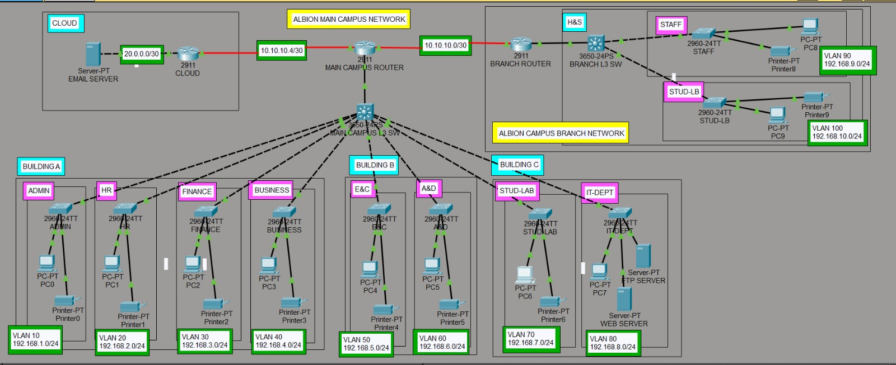
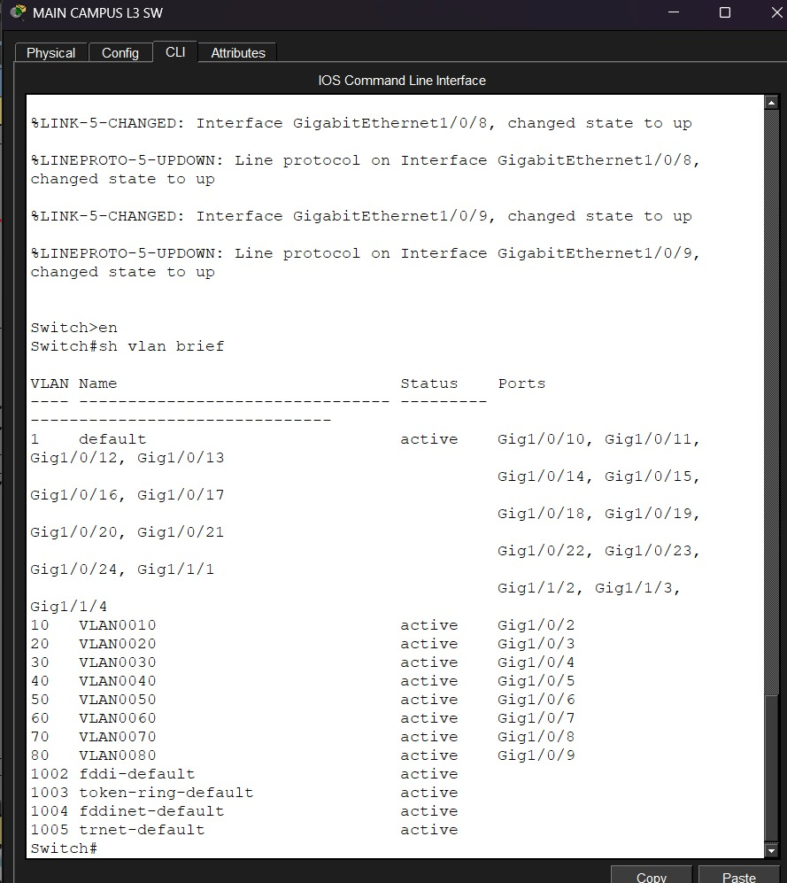
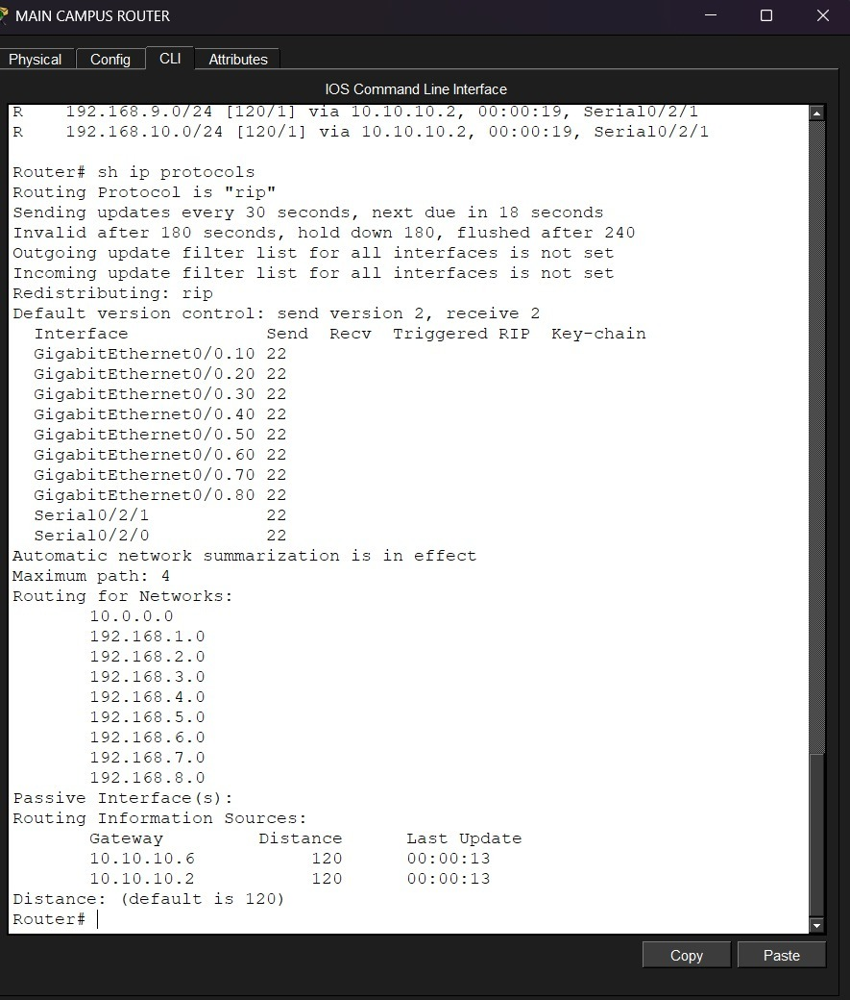

# Albion University Network

A Cisco Packet Tracer project based on a university network with two campuses, multiple buildings, separate departments, VLANs, internal servers, DHCP and RIPv2 routing.

This was one of my larger Packet Tracer labs, so I used it to practice putting different networking concepts together instead of configuring them separately.

## Topology



The network has:

- Main Campus
- Smaller Branch Campus
- Multiple buildings and departments
- VLANs for separate departments
- Layer 3 switching
- Internal web and FTP servers
- External email server
- RIPv2 routing
- Router-based DHCP

---

## Network Layout

### Main Campus

The main campus is divided into three buildings.

**Building A**
- Admin
- HR
- Finance
- Business

**Building B**
- Engineering & Computing
- Art & Design

**Building C**
- Student Lab
- IT Department
- Web Server
- FTP Server

### Branch Campus

The smaller campus contains:

- Staff network
- Student Lab

The branch campus is connected to the main campus through a router.

There is also an external cloud network containing an email server.

---

## VLAN & IP Addressing

Each department/faculty is kept on a separate VLAN and IP network.

| Department | VLAN | Network |
|---|---:|---|
| Admin | 10 | 192.168.1.0/24 |
| HR | 20 | 192.168.2.0/24 |
| Finance | 30 | 192.168.3.0/24 |
| Business | 40 | 192.168.4.0/24 |
| Engineering & Computing | 50 | 192.168.5.0/24 |
| Art & Design | 60 | 192.168.6.0/24 |
| Student Lab | 70 | 192.168.7.0/24 |
| IT Department | 80 | 192.168.8.0/24 |
| Staff | 90 | 192.168.9.0/24 |
| Branch Student Lab | 100 | 192.168.10.0/24 |

The router-to-router links use /30 networks.

---

## VLAN Configuration

VLANs were created to keep the different departments on separate networks while allowing them to share the network infrastructure.

The main campus Layer 3 switch handles the VLANs for the different departments.



---

## Routing - RIPv2

RIPv2 was used for routing between the internal routers.

The main campus router and branch router exchange their network information using RIP, allowing devices on different networks to communicate.

I checked the routing table and RIP configuration using Cisco IOS commands.



### Routing commands used

```text
show ip route
show ip protocols
show ip interface brief
