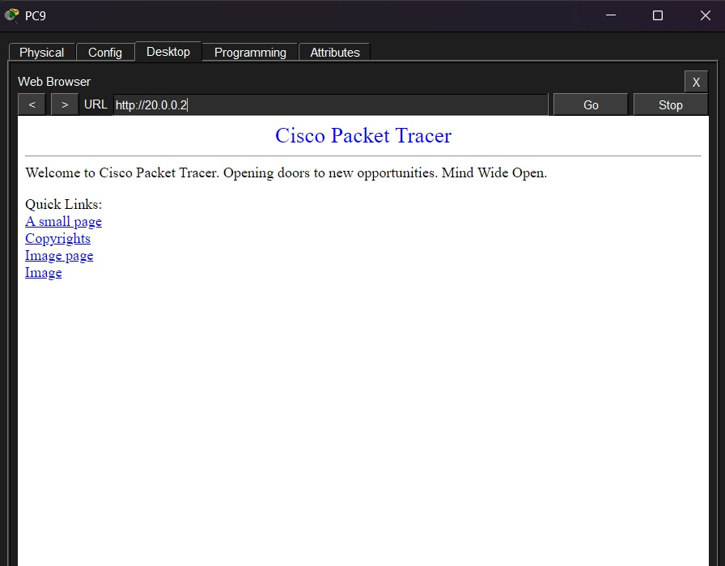

# Albion University Network

A Cisco Packet Tracer project based on a university network with two campuses, multiple buildings, different departments, VLANs, servers, DHCP and RIPv2.

I built this project to practice putting different networking concepts together in one topology instead of doing small labs for each topic separately.

---

## Topology


The network is divided into three main parts:

- Albion Main Campus
- Health & Sciences Branch Campus
- External Cloud Network

There are three routers in the topology:

- Main Campus Router
- Branch Router
- Cloud Router

The main campus also uses a Layer 3 switch to connect the different buildings and departments.

---

## Main Campus

The main campus has three buildings.

### Building A

- Admin
- HR
- Finance
- Business

### Building B

- Engineering & Computing
- Art & Design

### Building C

- Student Lab
- IT Department
- Web Server
- FTP Server

Each department is kept on a separate VLAN and IP network.

---

## Branch Campus

The smaller campus contains the Health & Sciences faculty.

It has:

- Staff network
- Student Lab network

The branch is connected to the main campus through the Branch Router.

---

## External Network

The external part of the topology contains:

- Cloud Router
- Email Server

The Cloud Router connects the external network to the Main Campus Router.

---

## VLAN & IP Addressing

Each department/faculty has its own VLAN and IP network.

| Department | VLAN | Network |
|---|---:|---|
| Admin | 10 | 192.168.1.0/24 |
| HR | 20 | 192.168.2.0/24 |
| Finance | 30 | 192.168.3.0/24 |
| Business | 40 | 192.168.4.0/24 |
| Engineering & Computing | 50 | 192.168.5.0/24 |
| Art & Design | 60 | 192.168.6.0/24 |
| Student Lab | 70 | 192.168.7.0/24 |
| IT Department | 80 | 192.168.8.0/24 |
| Staff | 90 | 192.168.9.0/24 |
| Branch Student Lab | 100 | 192.168.10.0/24 |

---

## Router-to-Router Networks

The routers are connected using `/30` networks.

| Connection | Network |
|---|---|
| Main Campus Router ↔ Branch Router | 10.10.10.0/30 |
| Cloud Router ↔ Main Campus Router | 10.10.10.4/30 |
| Cloud Router ↔ Email Server | 20.0.0.0/30 |

The basic router layout is:

```text
Email Server
     |
20.0.0.0/30
     |
Cloud Router
     |
10.10.10.4/30
     |
Main Campus Router
     |
10.10.10.0/30
     |
Branch Router


```
---

## Server Connectivity

The IT department contains the internal Web Server and FTP Server.

I tested connectivity to the servers from other networks to make sure the routing was working correctly.



---

## Network Verification

Some of the Cisco IOS commands I used while checking the network were:

```text
show vlan brief
show ip route
show ip protocols
show ip interface brief
show ip dhcp binding
show ip dhcp pool
