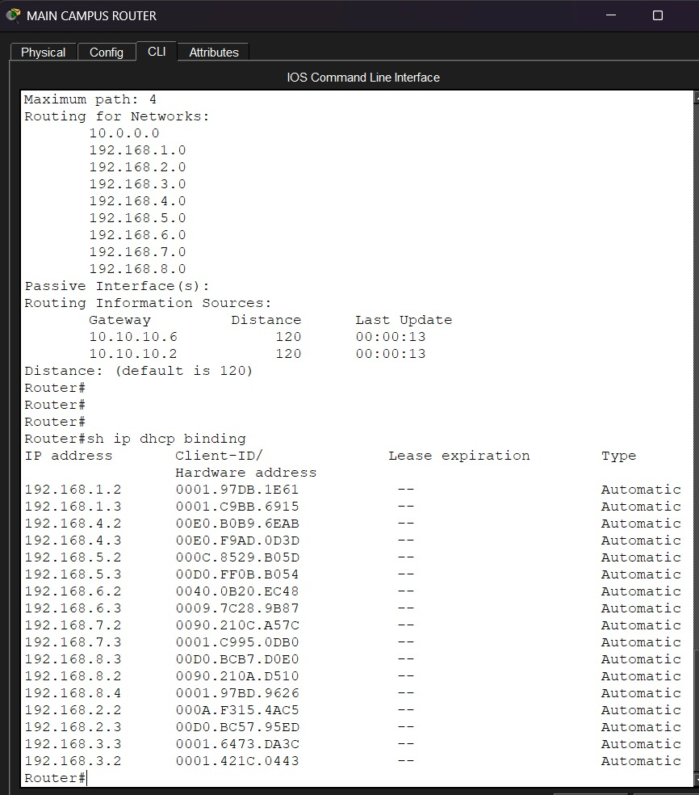
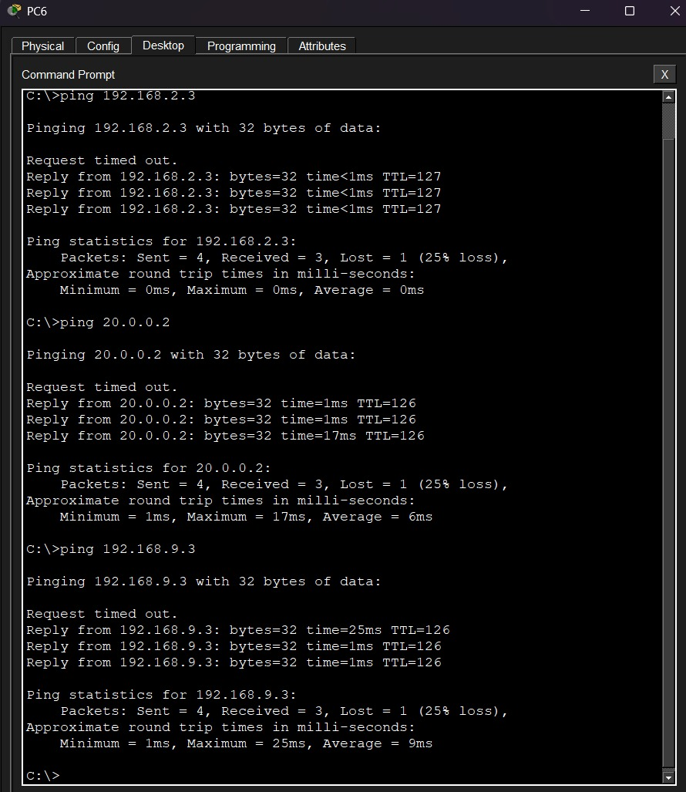

# Albion University Network

A Cisco Packet Tracer project based on a university network with two campuses, multiple buildings, different departments, VLANs, servers, DHCP and RIPv2.

I built this project to practice putting different networking concepts together in one larger topology instead of configuring each topic separately.

---

## Topology


The network is divided into three main parts:

- Albion Main Campus
- Health & Sciences Branch Campus
- External Cloud Network

There are three routers in the topology:

- Main Campus Router
- Branch Router
- Cloud Router

The main campus also uses a Layer 3 switch to connect the different buildings and departments.

---

## Main Campus

The main campus has three buildings.

### Building A

- Admin
- HR
- Finance
- Business

### Building B

- Engineering & Computing
- Art & Design

### Building C

- Student Lab
- IT Department
- Web Server
- FTP Server

Each department is assigned its own VLAN and IP network.

---

## Branch Campus

The smaller campus contains the Health & Sciences faculty.

It has:

- Staff network
- Student Lab network

The branch campus is connected to the main campus through the Branch Router.

---

## External Network

The external part of the topology contains:

- Cloud Router
- External Email Server

The Cloud Router connects the external network to the Main Campus Router.

---

## VLAN & IP Addressing

Each department or faculty has its own VLAN and IP network.

| Department | VLAN | Network |
|---|---:|---|
| Admin | 10 | 192.168.1.0/24 |
| HR | 20 | 192.168.2.0/24 |
| Finance | 30 | 192.168.3.0/24 |
| Business | 40 | 192.168.4.0/24 |
| Engineering & Computing | 50 | 192.168.5.0/24 |
| Art & Design | 60 | 192.168.6.0/24 |
| Student Lab | 70 | 192.168.7.0/24 |
| IT Department | 80 | 192.168.8.0/24 |
| Staff | 90 | 192.168.9.0/24 |
| Branch Student Lab | 100 | 192.168.10.0/24 |

---

## Router-to-Router Networks

The routers are connected using `/30` networks.

| Connection | Network |
|---|---|
| Main Campus Router ↔ Branch Router | 10.10.10.0/30 |
| Cloud Router ↔ Main Campus Router | 10.10.10.4/30 |
| Cloud Router ↔ Email Server | 20.0.0.0/30 |

### Router Layout

```text
                    Email Server
                         |
                     20.0.0.0/30
                         |
                    Cloud Router
                         |
                    10.10.10.4/30
                         |
                Main Campus Router
                         |
                    10.10.10.0/30
                         |
                    Branch Router
```
---

## VLAN Configuration

Separate VLANs were created for the different departments so they can have their own networks while sharing the same physical infrastructure.

The main campus Layer 3 switch is used to connect the different VLANs and provide communication between the departmental networks.


---

## Routing - RIPv2

RIPv2 is used for routing between the three routers:

- Main Campus Router
- Branch Router
- Cloud Router

The routers exchange their network information using RIPv2, allowing devices on the different networks to communicate.


### Routing Verification Commands

```text
show ip route
show ip protocols
show ip interface brief
```

---

## DHCP

Router-based DHCP is configured to automatically assign IPv4 addresses to end devices.

I checked the DHCP bindings and pools to make sure devices were receiving addresses correctly.



### DHCP Verification Commands

```text
show ip dhcp binding
show ip dhcp pool
```

---

## Server Connectivity

Building C contains the IT Department along with the internal Web Server and FTP Server.

I tested connectivity to the servers from different networks to make sure the routing and communication were working correctly.


The external Email Server is connected through the Cloud Router.

---

## Connectivity Testing

After configuring the VLANs, IP addressing, DHCP and RIPv2, I tested connectivity between different networks.

The tests included:

- Communication between different VLANs
- Main Campus to Branch Campus
- Main Campus to the external network
- Connectivity to the Web Server
- Connectivity to the FTP Server
- Connectivity to the external Email Server



---

## Network Verification Commands

Some of the Cisco IOS commands I used while checking and troubleshooting the network were:

```text
show vlan brief
show ip route
show ip protocols
show ip interface brief
show ip dhcp binding
show ip dhcp pool
```

These commands helped me check VLANs, interfaces, routing information and DHCP leases during the lab.

---

## What I Practiced

This project gave me hands-on practice with:

- VLAN configuration
- Layer 3 switching
- IP addressing
- `/30` point-to-point networks
- RIPv2 routing
- Router-based DHCP
- Connecting multiple buildings
- Connecting two campuses
- Internal server connectivity
- External network connectivity
- Cisco IOS verification commands
- Basic network troubleshooting

---

## Project Structure

```text
04-albion-university-network/
│
├── images/
│   ├── topology.png
│   ├── vlan-verification.png
│   ├── rip-verification.png
│   ├── dhcp-verification.png
│   ├── connectivity-test.png
│   └── server-connectivity.png
│
├── albion-university-network.pkt
└── README.md
```

---

## Tools Used

- Cisco Packet Tracer
- Cisco IOS CLI

---

## Project Status

**Completed**

Built and tested in Cisco Packet Tracer as part of my networking practice. This project helped me get more comfortable with larger topologies and understanding how VLANs, routing, DHCP, servers and multiple network segments work together.
