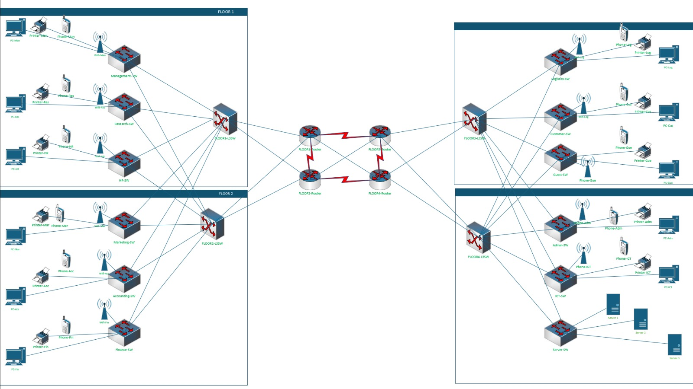
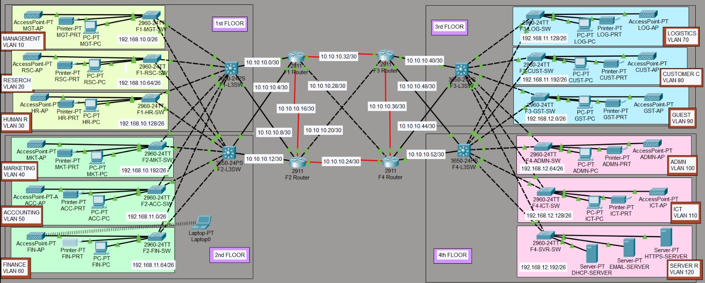
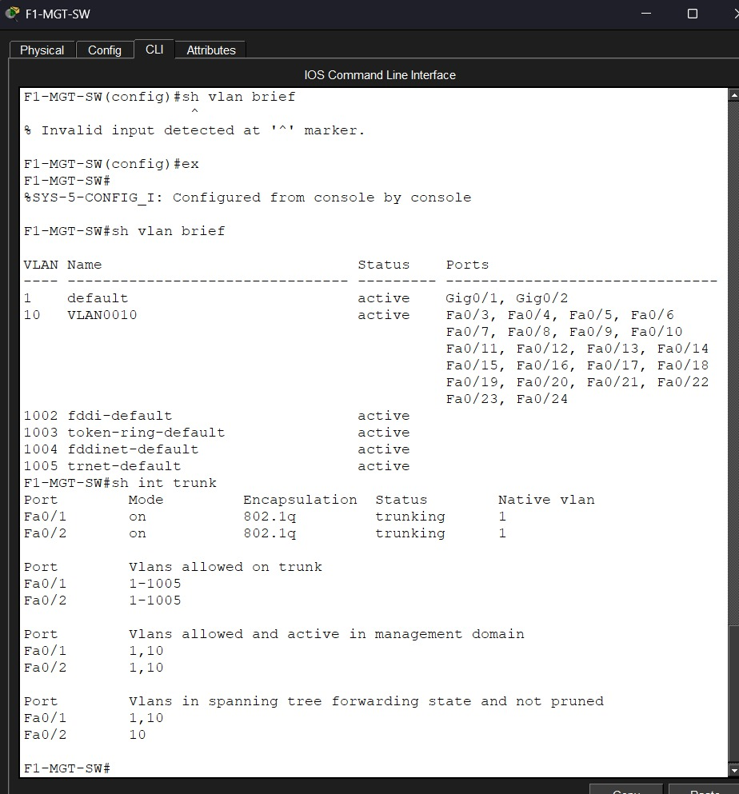
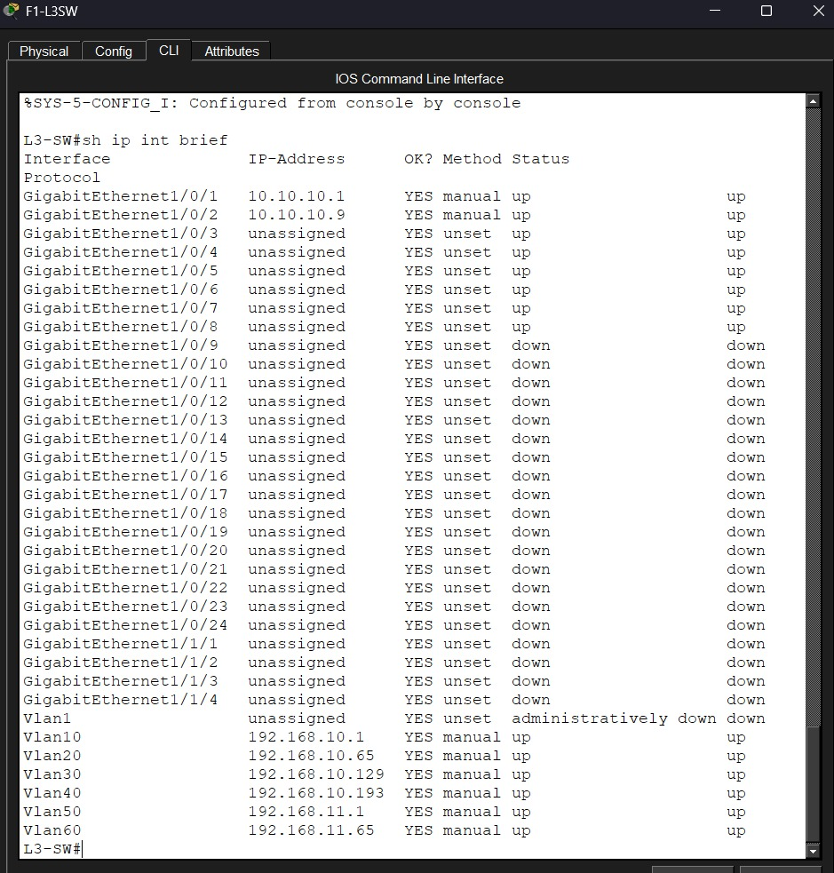
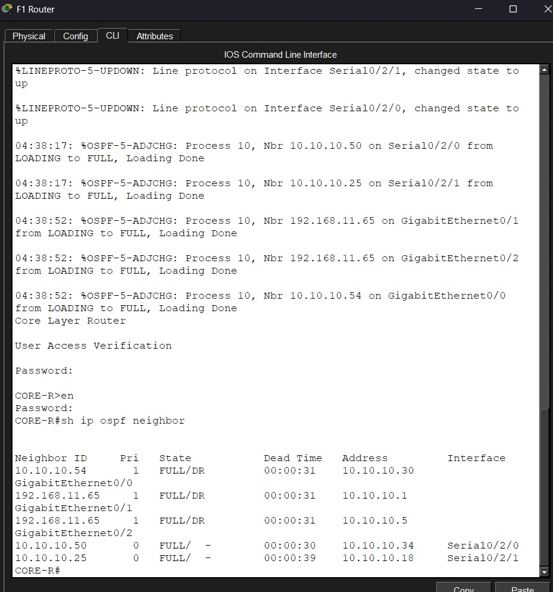
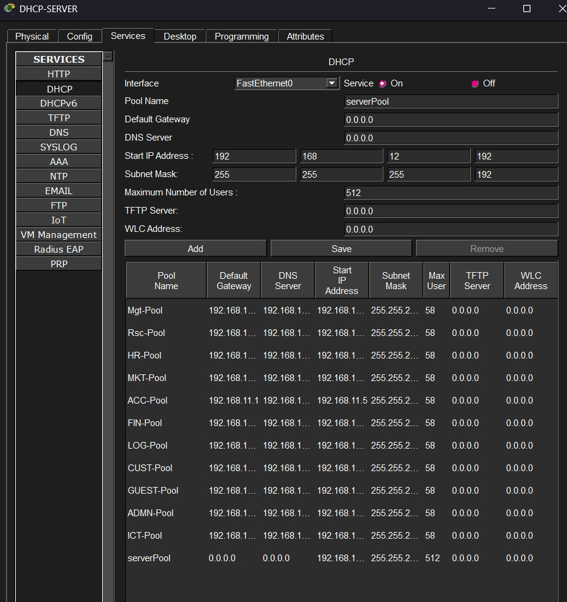
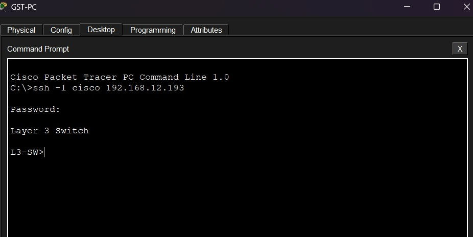
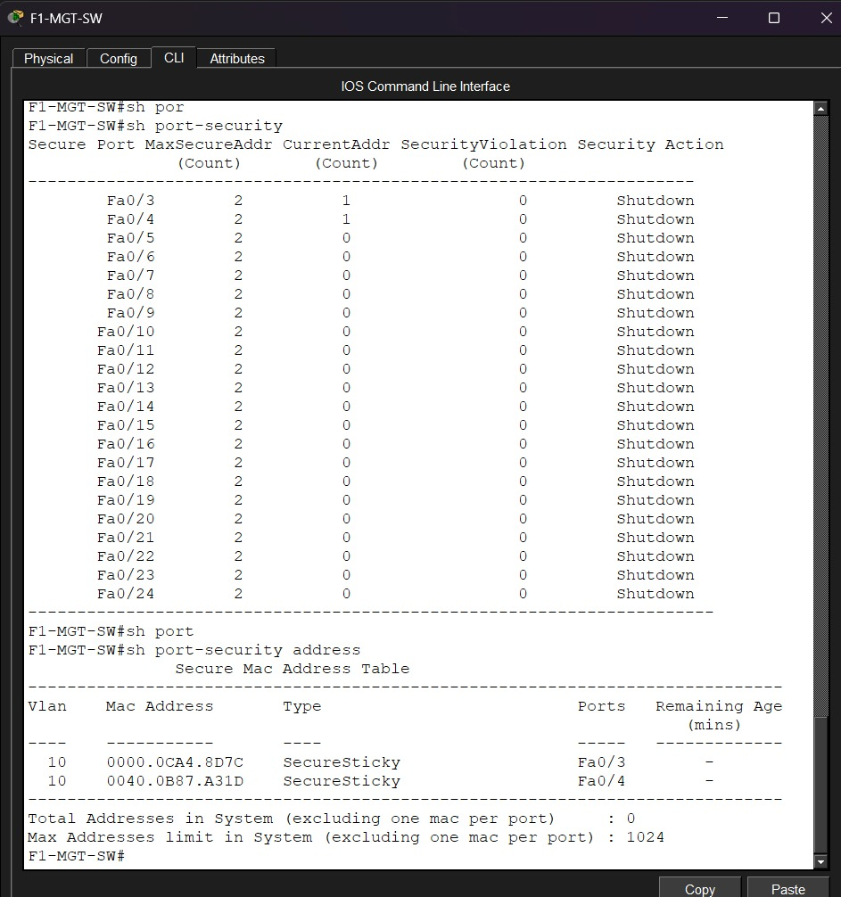
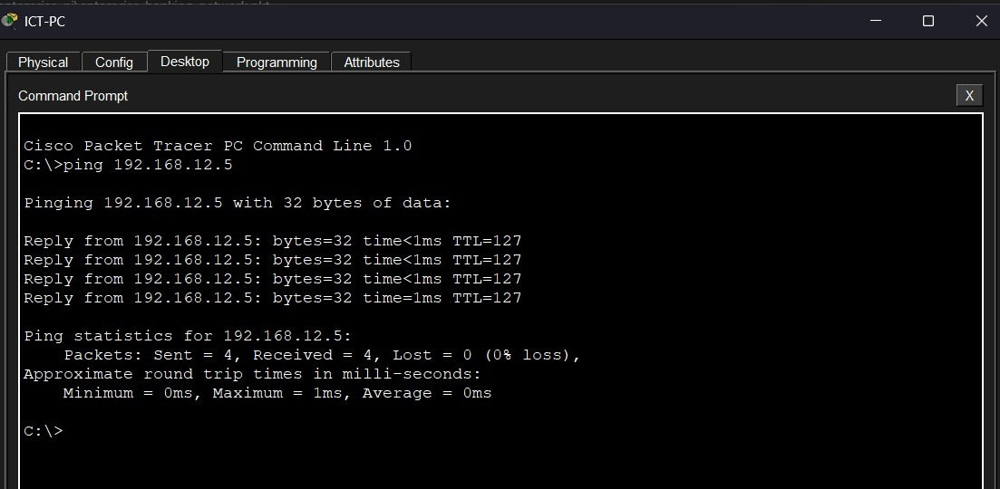

# Enterprise Banking Network

This project is based on an enterprise banking and insurance company expanding its services to Nairobi, Kenya. The network is designed for a four-story building with different departments on each floor.

I designed the network using Microsoft Visio and implemented it in Cisco Packet Tracer. The project helped me practice enterprise network design, subnetting, VLANs, OSPF, DHCP, wireless networking, SSH, and switch port security.

---

## Project Overview

The network contains different departments distributed across four floors. Each department is assigned a separate VLAN and subnet to organize the network and separate departmental traffic.

The project includes:

- Four-floor enterprise network
- Routers for inter-floor communication
- Layer 3 switches
- VLANs for different departments
- OSPF dynamic routing
- Inter-VLAN routing
- DHCP server
- HTTP server
- Email server
- Wireless access points
- SSH remote access
- Switch port security
- IPv4 subnetting and IP address planning
- Redundant connections between network devices

---

## Network Design

I first created a network design model using Microsoft Visio to plan the structure of the enterprise network.

The Visio design shows the different floors, departments, network devices, and connections. After preparing the design, I implemented the network in Cisco Packet Tracer.

### Network Design Model



### Tools Used for Design and Implementation

- Microsoft Visio
- Cisco Packet Tracer

---

## Network Topology



The network is divided into four floors:

- First Floor
- Second Floor
- Third Floor
- Fourth Floor

Each floor contains multiple departments. The fourth floor also contains the server room, which includes the DHCP, HTTP, and Email servers.

The routers are connected using point-to-point networks, and OSPF is used to advertise routes between the different network segments.

---

## Departments and Network Structure

### First Floor

The first floor contains:

- Management
- Research
- Human Resources

| Department | VLAN | Network |
|---|---:|---|
| Management | 10 | 192.168.10.0/26 |
| Research | 20 | 192.168.10.64/26 |
| Human Resources | 30 | 192.168.10.128/26 |

### Second Floor

The second floor contains:

- Marketing
- Accounting
- Finance

| Department | VLAN | Network |
|---|---:|---|
| Marketing | 40 | 192.168.10.192/26 |
| Accounting | 50 | 192.168.11.0/26 |
| Finance | 60 | 192.168.11.64/26 |

### Third Floor

The third floor contains:

- Logistics and Store
- Customer Care
- Guest Area

| Department | VLAN | Network |
|---|---:|---|
| Logistics and Store | 70 | 192.168.11.128/26 |
| Customer Care | 80 | 192.168.11.192/26 |
| Guest Area | 90 | 192.168.12.0/26 |

### Fourth Floor

The fourth floor contains:

- Administration
- ICT
- Server Room

| Department | VLAN | Network |
|---|---:|---|
| Administration | 100 | 192.168.12.64/26 |
| ICT | 110 | 192.168.12.128/26 |
| Server Room | 120 | 192.168.12.192/26 |

The server room contains:

- DHCP Server
- HTTP Server
- Email Server
- Administrative PCs

---

## VLAN Configuration

Each department is assigned a separate VLAN. This helps organize departmental traffic and allows the network to be managed using separate logical networks.

### VLAN List

| VLAN | Department |
|---:|---|
| 10 | Management |
| 20 | Research |
| 30 | Human Resources |
| 40 | Marketing |
| 50 | Accounting |
| 60 | Finance |
| 70 | Logistics and Store |
| 80 | Customer Care |
| 90 | Guest Area |
| 100 | Administration |
| 110 | ICT |
| 120 | Server Room |

The VLANs were configured on the switches, and access and trunk ports were assigned according to the network topology.



### VLAN Configuration Tasks

- Created VLANs for the departments
- Assigned switch ports to the correct VLANs
- Configured access ports
- Configured trunk ports
- Configured inter-VLAN routing
- Verified VLAN assignments using Cisco IOS commands

---

## IP Addressing and Subnetting

The base network provided for the project was:

```text
192.168.10.0
```

Subnetting was performed based on the number of users and devices required in each department.

A `/26` subnet was used for the departmental networks.

### Departmental Subnet Details

```text
Subnet Mask: 255.255.255.192
Prefix: /26
Total Addresses: 64
Usable Host Addresses: 62
```

A `/26` subnet provides 62 usable host addresses, which can be used for the wired and wireless users in each department.

### Departmental IP Addressing

| Department | Network Address | Subnet Mask | Usable Host Range | Broadcast Address |
|---|---|---|---|---|
| Management | 192.168.10.0/26 | 255.255.255.192 | 192.168.10.1 - 192.168.10.62 | 192.168.10.63 |
| Research | 192.168.10.64/26 | 255.255.255.192 | 192.168.10.65 - 192.168.10.126 | 192.168.10.127 |
| Human Resources | 192.168.10.128/26 | 255.255.255.192 | 192.168.10.129 - 192.168.10.190 | 192.168.10.191 |
| Marketing | 192.168.10.192/26 | 255.255.255.192 | 192.168.10.193 - 192.168.10.254 | 192.168.10.255 |
| Accounting | 192.168.11.0/26 | 255.255.255.192 | 192.168.11.1 - 192.168.11.62 | 192.168.11.63 |
| Finance | 192.168.11.64/26 | 255.255.255.192 | 192.168.11.65 - 192.168.11.126 | 192.168.11.127 |
| Logistics and Store | 192.168.11.128/26 | 255.255.255.192 | 192.168.11.129 - 192.168.11.190 | 192.168.11.191 |
| Customer Care | 192.168.11.192/26 | 255.255.255.192 | 192.168.11.193 - 192.168.11.254 | 192.168.11.255 |
| Guest Area | 192.168.12.0/26 | 255.255.255.192 | 192.168.12.1 - 192.168.12.62 | 192.168.12.63 |
| Administration | 192.168.12.64/26 | 255.255.255.192 | 192.168.12.65 - 192.168.12.126 | 192.168.12.127 |
| ICT | 192.168.12.128/26 | 255.255.255.192 | 192.168.12.129 - 192.168.12.190 | 192.168.12.191 |
| Server Room | 192.168.12.192/26 | 255.255.255.192 | 192.168.12.193 - 192.168.12.254 | 192.168.12.255 |



The IP addressing plan was prepared before configuring the devices. This helped me assign separate networks to the departments and avoid overlapping IP addresses.

---

## Router-to-Router Networks

Point-to-point connections between the routers use `/30` networks.

A `/30` subnet contains four total addresses:

- One network address
- Two usable host addresses
- One broadcast address

### Point-to-Point Subnet Details

```text
Subnet Mask: 255.255.255.252
Prefix: /30
Total Addresses: 4
Usable Host Addresses: 2
```

### Router Network Addressing

| Network Address | Subnet Mask | Usable Host Range | Broadcast Address |
|---|---|---|---|
| 10.10.10.0/30 | 255.255.255.252 | 10.10.10.1 - 10.10.10.2 | 10.10.10.3 |
| 10.10.10.4/30 | 255.255.255.252 | 10.10.10.5 - 10.10.10.6 | 10.10.10.7 |
| 10.10.10.8/30 | 255.255.255.252 | 10.10.10.9 - 10.10.10.10 | 10.10.10.11 |
| 10.10.10.12/30 | 255.255.255.252 | 10.10.10.13 - 10.10.10.14 | 10.10.10.15 |
| 10.10.10.16/30 | 255.255.255.252 | 10.10.10.17 - 10.10.10.18 | 10.10.10.19 |
| 10.10.10.20/30 | 255.255.255.252 | 10.10.10.21 - 10.10.10.22 | 10.10.10.23 |
| 10.10.10.24/30 | 255.255.255.252 | 10.10.10.25 - 10.10.10.26 | 10.10.10.27 |
| 10.10.10.28/30 | 255.255.255.252 | 10.10.10.29 - 10.10.10.30 | 10.10.10.31 |
| 10.10.10.32/30 | 255.255.255.252 | 10.10.10.33 - 10.10.10.34 | 10.10.10.35 |
| 10.10.10.36/30 | 255.255.255.252 | 10.10.10.37 - 10.10.10.38 | 10.10.10.39 |
| 10.10.10.40/30 | 255.255.255.252 | 10.10.10.41 - 10.10.10.42 | 10.10.10.43 |
| 10.10.10.44/30 | 255.255.255.252 | 10.10.10.45 - 10.10.10.46 | 10.10.10.47 |
| 10.10.10.48/30 | 255.255.255.252 | 10.10.10.49 - 10.10.10.50 | 10.10.10.51 |
| 10.10.10.52/30 | 255.255.255.252 | 10.10.10.53 - 10.10.10.54 | 10.10.10.55 |

The `/30` networks were used for the point-to-point connections between the routers.

---

## OSPF Routing

OSPF was configured to advertise routes between the routers and the different network segments.

The routers use OSPF to learn routes dynamically and communicate with networks located on other floors.

### OSPF Configuration Tasks

- Enabled OSPF on the routers
- Configured OSPF area 0
- Advertised point-to-point networks
- Advertised departmental networks
- Checked OSPF neighbor relationships
- Verified learned routes in the routing table



### OSPF Verification Commands

```text
show ip ospf neighbor
show ip route
show ip protocols
show ip interface brief
```

These commands were used to check OSPF neighbors, learned routes, routing protocols, and interface status.

---

## DHCP Configuration

A dedicated DHCP server was configured in the server room.

The DHCP server automatically assigns IP addresses to end devices across the different networks. DHCP relay configuration was used where required so that devices in different VLANs could receive addresses from the central DHCP server.

### DHCP Configuration Tasks

- Configured the DHCP server
- Created DHCP pools for the different networks
- Configured default gateways
- Configured subnet masks
- Configured DHCP relay addresses
- Tested automatic IP address allocation



The DHCP configuration was checked to confirm that end devices could receive IP addresses automatically.

---

## Wireless Network Configuration

Wireless access points were added to the departments on the different floors.

The access points allow users to connect to the departmental networks without using a physical cable.

### Wireless Configuration Tasks

- Added wireless access points
- Connected access points to the departmental switches
- Configured wireless network settings
- Connected wireless devices to the network
- Tested connectivity between wired and wireless devices

The wireless configuration was included to represent the wired and wireless users in the enterprise environment.

---

## Server Configuration

The server room is located on the fourth floor.

The following servers were included:

| Server | Purpose |
|---|---|
| DHCP Server | Automatically assigns IP addresses |
| HTTP Server | Provides web services |
| Email Server | Provides email services |

The server devices were assigned IP addresses from the Server Room network.

The servers were connected to the network so that users from different departments could communicate with them.

---

## SSH Configuration

SSH was configured on the routers for remote management.

SSH allows remote access to the Cisco IOS command line through a secure connection.

### SSH Configuration Tasks

- Configured device hostnames
- Set a domain name
- Created local user accounts
- Configured passwords
- Generated RSA keys
- Enabled SSH on the VTY lines
- Configured local login through SSH



### SSH Verification Commands

```text
show ip ssh
show running-config
```

SSH configuration was tested to check whether remote access was working correctly.

---

## Switch Port Security

Port security was configured on the switches to control which devices could connect to selected access ports.

Sticky MAC address learning was used to learn and save the MAC address of connected devices.

The violation mode was configured as shutdown.

### Port Security Configuration Tasks

- Enabled port security on selected switch ports
- Configured sticky MAC address learning
- Limited the number of allowed MAC addresses
- Configured violation mode as shutdown
- Checked the port security status



### Port Security Verification Commands

```text
show port-security
show port-security interface
show running-config
```

Port security helped me practice basic switch-level security and understand how unauthorized devices can cause a port security violation.

---

## Basic Device Configuration

Basic configuration was performed on the routers and switches.

The configuration included:

- Hostnames
- Console passwords
- VTY passwords
- Local user accounts
- Banner messages
- Encrypted passwords
- Disabled domain lookup
- SSH configuration
- Interface addressing

These settings were configured before moving on to the VLAN, routing, and security configurations.

---

## Verification and Testing

After completing the configuration, I tested the network to check whether the different devices and departments could communicate.

The testing included:

- Checking VLAN assignments
- Checking interface status
- Testing DHCP address allocation
- Checking OSPF neighbors
- Checking routing tables
- Testing communication between VLANs
- Testing communication between floors
- Testing access to the servers
- Testing SSH access
- Checking port security status



### Connectivity Testing Commands

```text
ping <destination-ip>
traceroute <destination-ip>
show ip interface brief
show ip route
show vlan brief
show ip ospf neighbor
show ip dhcp binding
show port-security
```

The ping and traceroute commands were used to test connectivity and identify possible addressing or routing problems.

---

## Verification Screenshots

### Network Design Model


### Network Topology


### IP Addressing Plan


### VLAN Verification


### OSPF Verification


### DHCP Verification


### SSH Verification


### Port Security Verification


### Connectivity Test


---

## What I Practiced

Through this project, I practiced:

- Enterprise network design
- Microsoft Visio network modeling
- Cisco Packet Tracer implementation
- VLAN creation and assignment
- Access and trunk port configuration
- Inter-VLAN routing
- OSPF routing
- IPv4 subnetting
- `/26` departmental networks
- `/30` point-to-point networks
- DHCP server configuration
- DHCP relay configuration
- Wireless access point configuration
- HTTP and Email server setup
- SSH remote access
- Switch port security
- Network verification and troubleshooting
- Connectivity testing between departments

---

## Project Structure

```text
05-enterprise-banking-network/
│
├── images/
│   ├── .gitkeep
│   ├── connectivity-test.png
│   ├── dhcp-pool.png
│   ├── ip-addressing.png
│   ├── ospf-verification.png
│   ├── port-security-verification.png
│   ├── ssh-verification.png
│   ├── topology.png
│   ├── visio-network-design.png
│   └── vlan-verification.png
│
├── enterprise-banking-network.pkt
└── README.md
```

---

## Tools Used

- Cisco Packet Tracer
- Microsoft Visio
- Cisco IOS CLI

---

## Project Status

**Completed**

This project was built and configured in Cisco Packet Tracer. It helped me understand how enterprise networking concepts work together in a multi-floor banking network, including VLANs, subnetting, OSPF, DHCP, wireless connectivity, SSH, and switch security.
