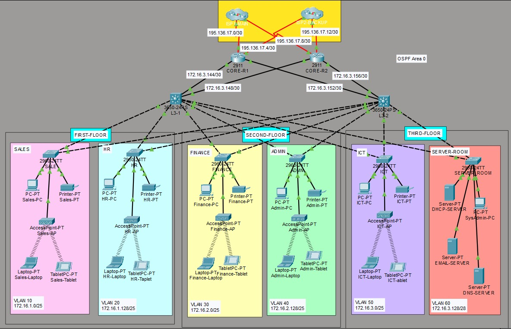

# Trading Floor Support Network

## Overview

This project is an enterprise network designed for a Trading Floor Support Centre with approximately 600 staff.

The company is moving into a new three-floor building, so the network was designed from the ground up to provide connectivity for all departments, centralized network services, wireless access and redundant connectivity.

The network was designed and implemented in Cisco Packet Tracer using two core routers and two multilayer switches. Each department is placed in a separate VLAN and subnet, while OSPF is used for dynamic routing between the core devices.

## Network Topology

The building is divided into three floors with two departments on each floor.

### First Floor

- Sales & Marketing — 120 users
- HR & Logistics — 120 users

### Second Floor

- Finance & Accounts — 120 users
- Administration & Public Relations — 120 users

### Third Floor

- ICT — 120 users
- Server Room — 12 devices

The Server Room contains the DHCP Server, Email Server, DNS Server and an Admin PC.

## IP Addressing and Subnetting

The base network provided for the project was:

`172.16.1.0`

The network was subnetted so that each department has its own network.

### First Floor

| Department | VLAN | Network | Subnet Mask | Host Range | Broadcast |
|---|---:|---|---|---|---|
| Sales & Marketing | 10 | `172.16.1.0/25` | `255.255.255.128` | `172.16.1.1 - 172.16.1.126` | `172.16.1.127` |
| HR & Logistics | 20 | `172.16.1.128/25` | `255.255.255.128` | `172.16.1.129 - 172.16.1.254` | `172.16.1.255` |

### Second Floor

| Department | VLAN | Network | Subnet Mask | Host Range | Broadcast |
|---|---:|---|---|---|---|
| Finance & Accounts | 30 | `172.16.2.0/25` | `255.255.255.128` | `172.16.2.1 - 172.16.2.126` | `172.16.2.127` |
| Administration & Public Relations | 40 | `172.16.2.128/25` | `255.255.255.128` | `172.16.2.129 - 172.16.2.254` | `172.16.2.255` |

### Third Floor

| Department | VLAN | Network | Subnet Mask | Host Range | Broadcast |
|---|---:|---|---|---|---|
| ICT | 50 | `172.16.3.0/25` | `255.255.255.128` | `172.16.3.1 - 172.16.3.126` | `172.16.3.127` |
| Server Room | 60 | `172.16.3.128/28` | `255.255.255.240` | `172.16.3.129 - 172.16.3.142` | `172.16.3.143` |

## Core Network

Two routers and two multilayer switches are used in the core to provide redundant connectivity.

The point-to-point links use `/30` networks:

| Connection | Network | Host Range | Broadcast |
|---|---|---|---|
| R1 - MLSW1 | `172.16.3.144/30` | `172.16.3.145 - 172.16.3.146` | `172.16.3.147` |
| R1 - MLSW2 | `172.16.3.148/30` | `172.16.3.149 - 172.16.3.150` | `172.16.3.151` |
| R2 - MLSW1 | `172.16.3.152/30` | `172.16.3.153 - 172.16.3.154` | `172.16.3.155` |
| R2 - MLSW2 | `172.16.3.156/30` | `172.16.3.157 - 172.16.3.158` | `172.16.3.159` |

## ISP Connectivity

The network connects to two ISPs for external connectivity and redundancy.

The public networks used for the ISP connections are:

- `195.136.17.0/30`
- `195.136.17.4/30`
- `195.136.17.8/30`
- `195.136.17.12/30`

Each core router has connections to the ISP networks.

## Network Configuration

### VLANs

Each department is assigned its own VLAN:

- VLAN 10 — Sales & Marketing
- VLAN 20 — HR & Logistics
- VLAN 30 — Finance & Accounts
- VLAN 40 — Administration & Public Relations
- VLAN 50 — ICT
- VLAN 60 — Server Room

Access and trunk ports are configured according to the network topology.

### Inter-VLAN Routing

The multilayer switches provide Layer 3 routing between the departmental VLANs.

### DHCP

A dedicated DHCP Server is located in the Server Room.

Client devices in the departmental VLANs obtain their IP configuration dynamically through the DHCP Server. DHCP helper addresses are configured on the multilayer switches to forward DHCP requests from the different VLANs.

Devices in the Server Room use static IP addresses.

### OSPF

OSPF is used as the dynamic routing protocol between the routers and multilayer switches.

The redundant links between the core devices provide multiple paths through the network.

### Wireless Networking

Each department has a wireless network for its users.

Access points are connected to the corresponding departmental networks to provide wireless connectivity.

### SSH

SSH is configured on the routers and Layer 3 switches for remote management.

### Port Security

Port security is configured for the Finance & Accounts department.

The selected switch port is configured to:

- Allow only one device
- Learn the MAC address using the sticky method
- Shut down the port when a security violation occurs

### PAT and ACL

PAT is configured on the outbound router interfaces so that internal private IP addresses can access the external network using the router's public IPv4 address.

An ACL is used to identify the internal traffic that is permitted for translation.
